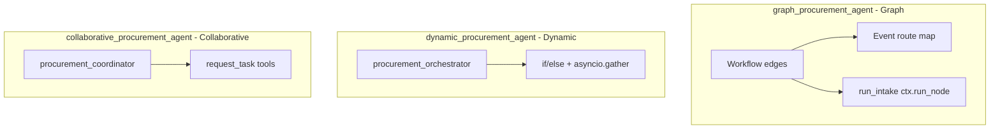

# ADK 2.0 — Case study: Enterprise Procurement Pipeline

This guide explains **Google Agent Development Kit (ADK) 2.0** using the sample apps in this repository. Setup is in [README.md](README.md). Each app has its own README with a flow diagram:

- [graph_procurement_agent/README.md](graph_procurement_agent/README.md) — Graph
- [dynamic_procurement_agent/README.md](dynamic_procurement_agent/README.md) — Dynamic
- [collaborative_procurement_agent/README.md](collaborative_procurement_agent/README.md) — Collaborative

Official reference: [Welcome to ADK 2.0](https://adk.dev/2.0/) (GA May 2026).

---

## What changed in ADK 2.0

ADK 2.0 introduces the **Workflow Runtime**: agents, tools, and Python functions are **nodes** in a graph (or invoked via `ctx.run_node`). The engine handles routing, parallelism, pauses, and retries.

| ADK 1.x | ADK 2.0 |
|---------|---------|
| `root_agent` transfers to sub-agents | `Workflow` runs **nodes** via **edges** |
| Procedure mostly in prompts | Structure in **graph** and/or **orchestrator code** |
| Custom `run()` overrides | Use **callbacks** and **Events** |

Migration notes: [ADK 2.0 compatibility](https://adk.dev/2.0/) — new `Event.node_info` / `Event.output`; do not append to `session.events` manually; do not catch `BaseException` in tools (breaks HITL).

---

## Three workflow paradigms (this repo)

| Paradigm | Docs | This repo | Control flow lives in |
|----------|------|-----------|------------------------|
| **Graph** | [Graph workflows](https://adk.dev/graphs/) | `graph_procurement_agent/` | `graph.py` edges + `routing.py` |
| **Dynamic** | [Dynamic workflows](https://adk.dev/workflows/dynamic/) | `dynamic_procurement_agent/` | `orchestrator.py` |
| **Collaborative** | [Collaboration](https://adk.dev/workflows/collaboration/) | `collaborative_procurement_agent/` | Coordinator LLM + delegation tools |

**Why three apps?** The same business rules are easier to compare when the **control style** changes but the story does not. Pick the paradigm that matches how you want to build and operate the system.

---

## Case study 1: Graph (`graph_procurement_agent`)

### Narrative

Structured intake → hydrate state → parallel legal + security review → route by verdict and cost → manager HITL if yearly cost **> 500 AED** → complete or loop back for a new request.

### Key code

| Feature | Location |
|---------|----------|
| `Workflow` edges | `graph.py` |
| `Event(route=...)` routing | `routing.py` `routing_logic` |
| Parallel fan-out | `(legal_reviewer, security_reviewer)` in `graph.py` |
| Multi-turn intake bridge | `routing.py` `run_intake` + `ctx.run_node(intake_specialist)` |
| Manager HITL | `routing.py` `manager_hitl` (`RequestInput`, same semantics as dynamic) |
| Post-HITL routes | `routing.py` `route_manager_hitl` → `approve` / `reject` edges |
| Purchase execution | `routing.py` `execute_purchase` + `record_purchase_in_state` |

Intake uses `ctx.run_node` because multi-turn intake agents are not placed on static graph edges in ADK 2.0 GA — see [graph app README](graph_procurement_agent/README.md).

### Graph vs “routing-only” dynamic

`routing_logic` returning `Event(route="reject")` is **graph routing**. A **dynamic** workflow puts the **entire loop** in an orchestrator `@node` with plain Python `if/else`.

---

## Case study 2: Dynamic (`dynamic_procurement_agent`)

### Narrative

`Workflow(edges=[("START", procurement_orchestrator)])` only. The orchestrator runs intake, parallel reviews (`asyncio.gather`), Python branching, and manager approval via **`RequestInput`** (not graph edges).

### When to prefer this over graph

- Loops and branches change often.
- You want **algorithmic** control (e.g. variable parallelism later).
- A large static edge list would be hard to maintain.

### Manager HITL in dynamic vs graph

| | Graph app | Dynamic app |
|--|-----------|-------------|
| HITL mechanism | `manager_hitl` graph node yields `RequestInput` (Yes/No in chat) | `manager_approval` child node yields `RequestInput` |
| Approval decision | `route_manager_hitl` → `Event(route="approve"\|"reject")` | `is_approval(response)` in orchestrator `if/else` |
| Purchase execution | `execute_purchase` graph node on `approve` edge | `await ctx.run_node(execute_purchase_node)` |
| Teaching contrast | **Where routing lives** — graph edges vs Python orchestrator | Same HITL UX; checkbox `require_confirmation` is in **collaborative** app only |

See [`graph_procurement_agent/routing.py`](graph_procurement_agent/routing.py) and [`dynamic_procurement_agent/orchestrator.py`](dynamic_procurement_agent/orchestrator.py).

---

## Case study 3: Collaborative (`collaborative_procurement_agent`)

### Narrative

The user speaks to `procurement_coordinator`, which delegates to specialists via framework `request_task_*` tools (intake, legal, security, manager).

### Trade-off

No `Workflow` graph in ADK Web UI — you see **agent transfer / delegation** instead of a pipeline diagram. Fits **multi-agent product** shapes where a coordinator decides who to call.

---

## Features matrix

| Feature | Graph app | Dynamic app | Collab app |
|---------|-----------|-------------|------------|
| `Workflow` | Yes | Yes (minimal) | No (root is `Agent`) |
| Static edges | Yes | One edge | N/A |
| `Event(route=...)` | Yes | No | N/A |
| `ctx.run_node` | Intake bridge | Full pipeline | Via delegation |
| Parallel fan-out | Edge tuple | `asyncio.gather` | Coordinator-driven |
| Multi-turn intake | `run_intake` bridge | Inside orchestrator | Coordinator delegates |
| Tool confirmation HITL | No | No | Yes |
| `RequestInput` HITL | Yes | Yes | N/A |
| `MockSQLiteSessionService` | Yes | Yes | No |

---

## Common misconceptions

1. **“Dynamic = one routing function”** — `routing_logic` in the graph app is still the **graph** paradigm; dynamic means a full orchestrator in Python.
2. **“Graph = strict DAG”** — Conditional loop-backs are allowed (e.g. reject → intake).
3. **“Graph = sequential”** — Fan-out tuples run reviewers in parallel.
4. **`db.py` = ADK persistence** — Demo sidecar only; production apps use ADK session services.

---

## Graph vs dynamic

| | Graph | Dynamic |
|--|-------|---------|
| Declare flow | `edges` in `graph.py` | Python in `orchestrator.py` |
| Branch | `Event(route=...)` | `if decision == "reject":` etc. |
| Parallelism | `(node_a, node_b)` tuple | `asyncio.gather` + `ctx.run_node` |
| Outer `Workflow` | Full pipeline graph | Often a single `START → orchestrator` edge |

Prefer **graph** when the pipeline is stable and you want a visible diagram. Prefer **dynamic** when logic is loop-heavy or runtime-shaped.

---

## Suggested extensions

- `JoinNode` for explicit fan-in aggregation
- `App` + `ResumabilityConfig` for production HITL resume
- `RequestInput` for non-tool human prompts
- Coordinator + `Workflow` hybrid for large systems

---

## Official resources

- [ADK 2.0 home](https://adk.dev/2.0/)
- [Graph workflows](https://adk.dev/graphs/)
- [Dynamic workflows](https://adk.dev/workflows/dynamic/)
- [Collaborative workflows](https://adk.dev/workflows/collaboration/)
- [Action confirmations (HITL tools)](https://adk.dev/tools-custom/confirmation/)
- [Workflow samples](https://github.com/google/adk-python/tree/v2/contributing/workflow_samples)

---

## Author

**Rohan Mitra** — Machine Learning Engineer & Researcher. Google Developer Expert — Cloud AI.

- Website: [rohanmitra.dev](https://rohanmitra.dev)
- LinkedIn: [linkedin.com/in/rohan-mitra14](https://www.linkedin.com/in/rohan-mitra14/)
