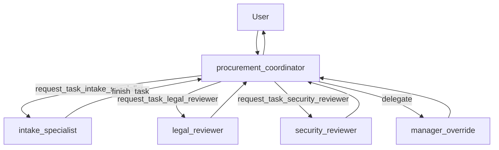

# Collaborative coordinator procurement

**Paradigm:** [Collaborative workflows](https://adk.dev/workflows/collaboration/) — chat coordinator `Agent` with `sub_agents` and auto-generated `request_task_{name}` tools.

**One sentence:** There is **no `Workflow` root**; the user talks to `procurement_coordinator`, which delegates to specialists.

## When to use this pattern

- You want **delegation-first** multi-agent design (the coordinator decides who to call).
- The flow is **conversational** rather than a fixed pipeline diagram.
- Specialists are reused as sub-agents instead of wiring every step in `graph.py`.

Compare with [../graph_procurement_agent/README.md](../graph_procurement_agent/README.md) (graph) and [../dynamic_procurement_agent/README.md](../dynamic_procurement_agent/README.md) (Python orchestrator).

## Flow diagram



ADK Web UI shows **agent transfer / task delegation**, not a `Workflow` graph.

## Control-flow owner

| Concern | Owned by |
|---------|----------|
| Who runs when | `procurement_coordinator` LLM + `request_task_*` tools |
| Structured intake | `intake_specialist` |
| Reviews | `legal_reviewer`, `security_reviewer` |
| HITL purchase | `manager_override` + [`tools.py`](tools.py) |

## File map

| File | Purpose |
|------|---------|
| [`agent.py`](agent.py) | `root_agent = procurement_coordinator` |
| [`agents.py`](agents.py) | Coordinator + all `sub_agents` |
| [`tools.py`](tools.py) | `execute_purchase_order` with confirmation |
| [`schemas.py`](schemas.py) | `ProcurementForm` for structured intake output |

## ADK 2.0 features in this app

- [x] Coordinator + `sub_agents` — [`agents.py`](agents.py)
- [x] Auto `request_task_{name}` delegation tools — framework-injected on coordinator
- [x] `FunctionTool(require_confirmation=True)` on manager — [`tools.py`](tools.py)

## How to run

```bash
cd adk-procurement-workshop
adk web .
```

Select **collaborative_procurement_agent** in the UI.

## Demo prompts

Costs are **yearly AED** (manager approval above **500 AED**).

| Scenario | Example |
|----------|---------|
| Start intake | "I need Notion for our team, about 350 AED per year." |
| After reject | "Legal rejected my request — I want HubSpot instead, 1,500 AED per year." |
| High cost | "Salesforce Enterprise, 55,000 AED per year." |

The coordinator decides which `request_task_*` tools to call; prompts can be higher-level than in the graph app.

## Related docs

- [../README.md](../README.md)
- [../ADK_2.0.md](../ADK_2.0.md)

## Author

**Rohan Mitra** — Machine Learning Engineer & Researcher. Google Developer Expert — Cloud AI · [rohanmitra.dev](https://rohanmitra.dev) · [LinkedIn](https://www.linkedin.com/in/rohan-mitra14/)
