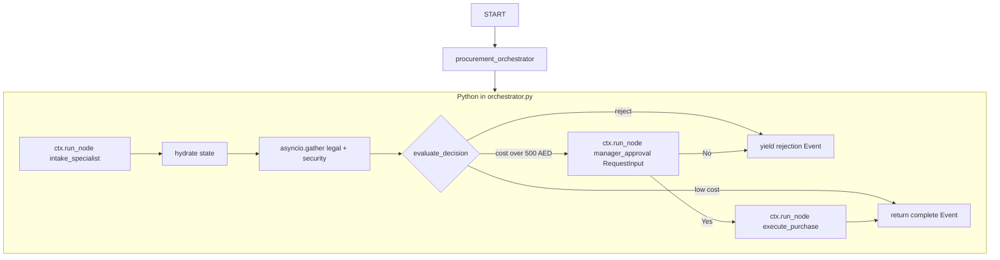

# Dynamic procurement workflow

**Paradigm:** [Dynamic workflows](https://adk.dev/workflows/dynamic/) — implement the pipeline in **Python** inside one orchestrator `@node`, with a **minimal** outer `Workflow`.

**One sentence:** `Workflow` has a single edge; `procurement_orchestrator` uses `ctx.run_node`, `asyncio.gather`, `if/else`, and `RequestInput` for manager HITL — no `Event(route=...)`.

## Flow diagram



## Graph vs dynamic (this repo)

| Concern | `graph_procurement_agent` | This app (dynamic) |
|---------|---------------------------|---------------------|
| Control flow | `graph.py` edges + `Event(route=...)` | `orchestrator.py` `if/else` + `yield`/`return` |
| Parallel reviews | Edge tuple `(legal, security)` | `asyncio.gather` + `ctx.run_node` |
| Manager HITL | Static `manager_override` + tool confirmation | `RequestInput` in `manager_approval` child node |
| Re-intake after deny | Graph edge back to `run_intake` | Next user turn reruns orchestrator; `intake_generation` bumps |

## Control-flow owner

| Concern | Owned by |
|---------|----------|
| Full pipeline | [`orchestrator.py`](orchestrator.py) — `procurement_orchestrator` |
| Helpers + HITL child nodes | [`routing.py`](routing.py) |
| LLM agents | [`agents.py`](agents.py) |
| Purchase state update | [`tools.py`](tools.py) — `record_purchase_in_state` |
| Graph shell | [`graph.py`](graph.py) — one edge only |

## File map

| File | Purpose |
|------|---------|
| [`agent.py`](agent.py) | `root_agent` |
| [`graph.py`](graph.py) | `Workflow(edges=[("START", procurement_orchestrator)])` |
| [`orchestrator.py`](orchestrator.py) | Main Python control loop |
| [`routing.py`](routing.py) | Intake/review helpers, `manager_approval`, `execute_purchase_node` |
| [`agents.py`](agents.py) | Intake + reviewer agents |
| [`tools.py`](tools.py) | Post-approval purchase recording |
| [`schemas.py`](schemas.py) | `ProcurementForm` |
| [`db.py`](db.py) | Optional state snapshots |

## ADK 2.0 features in this app

- [x] Single-edge `Workflow` + dynamic orchestrator
- [x] `ctx.run_node` + `raise_on_wait=True` for intake
- [x] `asyncio.gather` + stable `run_id` for parallel reviews
- [x] Pure Python branching — `evaluate_decision` (no `Event(route=...)`)
- [x] `RequestInput` HITL — `manager_approval` (`rerun_on_resume=False`)
- [x] Parent `rerun_on_resume=True` on orchestrator for resume/checkpointing

## How to run

```bash
cd adk-procurement-workshop
adk web .
```

Select **dynamic_procurement_agent**. Start a **new session** after code changes.

## Demo path

1. Request software with yearly cost **over 500 AED** (e.g. Google Workspace — state monthly cost; intake converts to yearly AED).
2. Pass legal/security in Events (internal reviewer lines).
3. Reply **Yes** to the manager `RequestInput` prompt.
4. See the completion message (includes purchase confirmation text in state).

To demo denial: reply **No** at the manager prompt → one rejection message → submit a new request on the next turn.

## Related docs

- [../README.md](../README.md)
- [../ADK_2.0.md](../ADK_2.0.md)

## Author

**Rohan Mitra** — Machine Learning Engineer & Researcher. Google Developer Expert — Cloud AI · [rohanmitra.dev](https://rohanmitra.dev) · [LinkedIn](https://www.linkedin.com/in/rohan-mitra14/)
