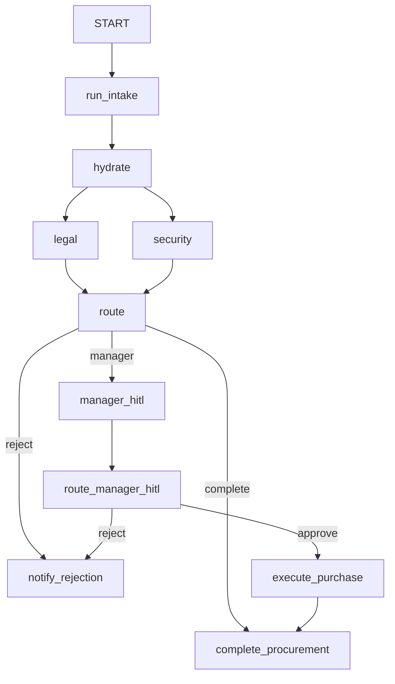

# Graph-based procurement workflow

**Paradigm:** [Graph-based workflows](https://adk.dev/graphs/) — explicit `Workflow` nodes and `edges`, with conditional routing via `Event(route=...)`.

**One sentence:** The process structure lives in `graph.py`; Python routing functions choose branches; parallel review uses edge fan-out.

## When to use this pattern

- The pipeline steps are **stable** and you want a **visible graph** in ADK Web UI.
- You need **parallel fan-out** and **conditional loops** without writing a full orchestrator.
- You want **graph validation** at build time (reachability, cycle rules).

Compare with [../dynamic_procurement_agent/README.md](../dynamic_procurement_agent/README.md) (Python orchestrator) and [../collaborative_procurement_agent/README.md](../collaborative_procurement_agent/README.md) (coordinator delegation).

## Flow diagram



`run_intake` calls `ctx.run_node(intake_specialist)` for multi-turn structured intake (see [ADK_2.0.md](../ADK_2.0.md)).

## Control-flow owner

| Concern | Owned by |
|---------|----------|
| Step order and parallelism | `graph.py` `edges` |
| Reject / manager / complete branches | `routing.py` → `Event(route=...)` |
| Multi-turn structured intake | `routing.py` `run_intake` + `agents.py` `intake_specialist` |
| Manager HITL (Yes/No) | `routing.py` `manager_hitl` → `RequestInput` |
| Purchase execution | `routing.py` `execute_purchase` + `tools.py` `record_purchase_in_state` |
| Workshop SQLite snapshot | `routing.py` → `db.py` (not ADK session service) |

## File map

| File | Purpose |
|------|---------|
| [`agent.py`](agent.py) | `root_agent` for `adk web` |
| [`graph.py`](graph.py) | `Workflow` edges only |
| [`routing.py`](routing.py) | `run_intake`, `routing_logic`, `manager_hitl`, `route_manager_hitl`, `execute_purchase`, terminals |
| [`agents.py`](agents.py) | Intake + reviewer LLM agents |
| [`tools.py`](tools.py) | `record_purchase_in_state` (no tool confirmation on graph path) |
| [`schemas.py`](schemas.py) | `ProcurementForm` |
| [`db.py`](db.py) | `MockSQLiteSessionService` demo |

## ADK 2.0 features in this app

- [x] `Workflow` + static `edges` — [`graph.py`](graph.py)
- [x] Parallel fan-out `(legal_reviewer, security_reviewer)` — [`graph.py`](graph.py)
- [x] Conditional routing dict map — [`routing.py`](routing.py)
- [x] Loop-back on reject — `reject` → `run_intake`
- [x] `ctx.run_node` bridge for intake — [`routing.py`](routing.py)
- [x] `output_schema` + `output_key` + `Event(state=...)` — agents + routing
- [x] `RequestInput` manager HITL — [`routing.py`](routing.py) `manager_hitl`
- [x] Graph branches on approval — `route_manager_hitl` → `approve` / `reject`
- [x] Terminal node (no outgoing edges) — `complete_procurement`

## How to run

```bash
cd adk-procurement-workshop
pip install -r requirements.txt
cp .env.example .env   # set GOOGLE_API_KEY
adk web .
```

Select **graph_procurement_agent** in the UI.

## Demo prompts

All costs are **yearly AED** (manager approval required above **500 AED**).

| Scenario | Example user message |
|----------|----------------------|
| Happy path (under 500 AED) | "I need Figma for design, 400 AED per year for wireframes." |
| Legal reject loop | "I need a penetration testing exploit kit, 150 AED per year." |
| Security fail | (Use a prompt that yields `Security: FAIL` from the security reviewer) |
| HITL (over 500 AED) | "Enterprise Salesforce license, 12,000 AED annually for the sales team." — reply **Yes** at manager prompt |
| Manager deny | Same HITL path — reply **No** at manager prompt |

Watch the terminal for `[MockSQLite] Saved state` during routing (optional state snapshot demo).

## Related docs

- [../README.md](../README.md)
- [../ADK_2.0.md](../ADK_2.0.md)

## Author

**Rohan Mitra** — Machine Learning Engineer & Researcher. Google Developer Expert — Cloud AI · [rohanmitra.dev](https://rohanmitra.dev) · [LinkedIn](https://www.linkedin.com/in/rohan-mitra14/)
